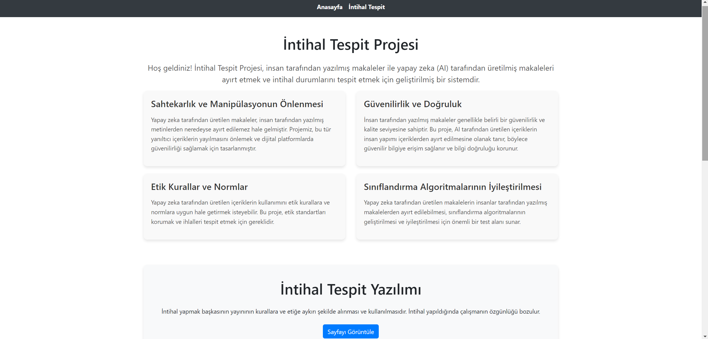
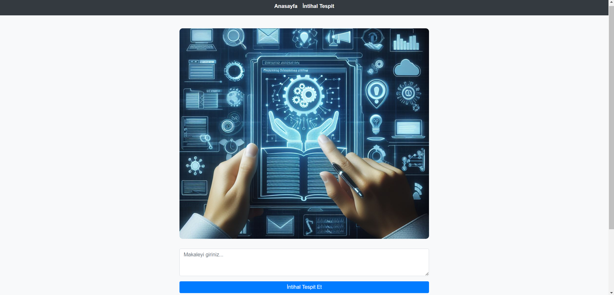

# İntihal Tespit Projesi

Bu proje, insanlar tarafından üretilmiş makaleler ile yapay zeka (AI) tarafından üretilmiş makaleler arasındaki farkı belirlemek ve intihal durumlarını tespit etmek için geliştirilmiş bir sistemdir. Dikkat edilmesi gereken, intihali tespit makaleler ingilizce formatta olmalıdır.

## 🚀 Proje Amaçları

Sahtekarlık ve manipülasyonun önlenmesi, güvenilirlik ve doğruluk, etik kurallar ve normlar, yapay zeka gelişimi ve sınıflandırma algoritmalarının iyileştirilmesi gibi amaçlar doğrultusunda bu proje geliştirilmiştir.

## ⭐ Özellikler

- **Anasayfa:** Projenin amacı, sağladığı faydalar, kullanım alanları gibi genel bilgiler.
- **İntihak Tespit:** Girilen makale metninin sınıflandırılmasını yapar.
  
### Sahtekarlık ve Manipülasyonun Önlenmesi

Yapay zeka tarafından üretilen makaleler, insan tarafından yazılmış metinlerden neredeyse ayırt edilemez hale gelmiştir. Projemiz, bu tür yanıltıcı içeriklerin yayılmasını önlemek ve dijital platformlarda güvenilirliği sağlamak için tasarlanmıştır.

### Güvenilirlik ve Doğruluk

İnsan tarafından yazılmış makaleler genellikle belirli bir güvenilirlik ve kalite seviyesine sahiptir. Bu proje, AI tarafından üretilen içeriklerin insan yapımı içeriklerden ayırt edilmesine olanak tanır, böylece güvenilir bilgiye erişim sağlanır ve bilgi doğruluğu korunur.

### Etik Kurallar ve Normlar

Yapay zeka tarafından üretilen içeriklerin kullanımını etik kurallara ve normlara uygun hale getirmek isteyebilir. Bu proje, etik standartları korumak ve ihlalleri tespit etmek için gereklidir.

### Sınıflandırma Algoritmalarının İyileştirilmesi

Yapay zeka tarafından üretilen makalelerin insanlar tarafından yazılmış makalelerden ayırt edilebilmesi, sınıflandırma algoritmalarının geliştirilmesi ve iyileştirilmesi için önemli bir test alanı sunar.
## 🛠️ Kullanılan Teknolojiler

- re
- nltk
- pickle
- django
- stopwords
- WordNetLemmatizer
- word_tokenize

## 📂 Nasıl Kullanılır?
Proje Django ile geliştirilmiştir. İlgili kodları çalıştırmak için;
1. Proje dosyalarını klonlayın veya indirin.
2. Gerekli bağımlılıkları yükleyin.
3. Uygulamayı başlatmak için gereken adımları izleyin.

## Uygulama Arayüzü
### - Anasayfa

### -İntihal Tespit

